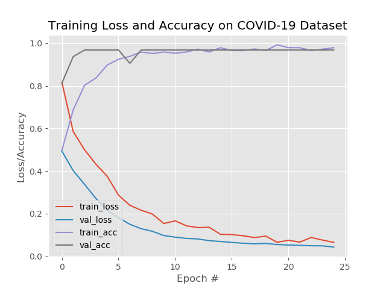
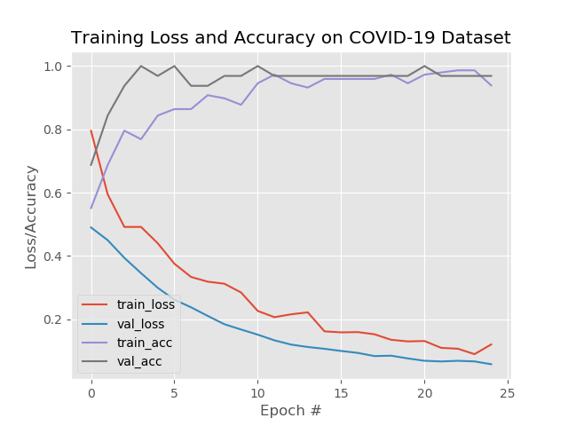

# CT or X-Ray COVID-19 Model 
Detecting COVID-19 in CT or X-ray images with Tensorflow. This project is part of **Bangk!t Assignment 5 - First Machine Learning Project MLCC**. 

## About Bangk!t


[Bangk!t](https://sites.google.com/view/bangkitacademy?pli=1) is a Google-led academy developed in collaboration with Gojek, Tokopedia, and Traveloka, designed to produce high-calibre, technical talent for world-class, Indonesian technology companies and startups. 

## Disclaimer
This project about COVID-19 detection is for **educational purposes only**. It is not meant to be a reliable, highly accurate COVID-19 diagnosis system, nor has it been professionally or academically vetted.

## Framing and Hypothesis
- COVID is possibly better diagnosed using radiological imaging [Fang, 2020](https://pubs.rsna.org/doi/10.1148/radiol.2020200432) and [Ai 2020](https://pubs.rsna.org/doi/10.1148/radiol.2020200642).
- While the diagnosis is confirmed using polymerase chain reaction (PCR), infected patients (COVID19+) with pneumonia may present on chest X-ray and computed tomography (CT) images with a pattern that is only moderately characteristic for the human eye [Ng, 2020](https://pubs.rsna.org/doi/10.1148/ryct.2020200034).
- Build ML model to predict COVID-19 (+) Pneumonia or not.

## Goal
Our goal is build ML model can detect accurately patient that do have COVID-19 from X-Ray image.

## Dataset
- Joseph Paul Cohen and Paul Morrison and Lan Dao
COVID-19 image data collection, arXiv:2003.11597, 2020
[covid-chestxray-dataset](https://github.com/ieee8023/covid-chestxray-dataset)

- Daniel Kermany and Kang Zhang and Michael Goldbaum
Labeled Optical Coherence Tomography (OCT) and Chest X-Ray Images for Classification, Mendeley Data, v2
[Chest X-Ray Images (Pneumonia)](https://www.kaggle.com/paultimothymooney/chest-xray-pneumonia)

## Data Preparation
Select data from [covid-chestxray-dataset](https://github.com/ieee8023/covid-chestxray-dataset) which following criterias:
  - Positive COVID-19 (ignoring MERS, SARS, and ARDS cases)
  - Posterioranterior (PA) view of the lungs. [Rosebrock, A (2020)](https://www.pyimagesearch.com/2020/03/16/detecting-covid-19-in-x-ray-images-with-keras-tensorflow-and-deep-learning/)

So, we get **97 X-Ray images** of have COVID-19 (_positive case_).

Then, we need to select X-Ray images which don't have COVID-19. We can select 97 of data from [Chest X-Ray Images (Pneumonia)](https://www.kaggle.com/paultimothymooney/chest-xray-pneumonia) for **healthy** patients which is inside folder named **NORMAL** or other case of **pneumonia** patients which is inside folder named **PNEUMONIA**.

In total, we have **194 images** contain 97 images positive COVID-19 and 97 images negative COVID-19. 

## Machine Learning Model Specification
### VGG16
#### Specification
- Transfer learning using **VGG16** (pretrained model *Imagenet*) 
- Learning rate 0.001
- Epoch 25
- Batch Size 8
- Adam Optimizer
- Loss function Binary Crossentropy
- Train 80% and test 20% of dataset

####  Result 
##### COVID-19 vs Healthy (NORMAL)
> [Download](covid19_VGG16.model) this model to test
```plain
              precision    recall  f1-score   support

       covid       0.95      1.00      0.97        19
      normal       1.00      0.95      0.97        20

    accuracy                           0.97        39
   macro avg       0.97      0.97      0.97        39
weighted avg       0.98      0.97      0.97        39

confusion matrix
[[19  0]
 [ 1 19]]

acc: 0.9744
sensitivity: 1.0000
specificity: 0.9500
```

**training history**




##### COVID-19 vs Others Pneumonia
> [Download](covid19_vs_OtherPneumonia_VGG16.model) this model to test
```plain
              precision    recall  f1-score   support

       covid       0.95      1.00      0.97        19
      normal       1.00      0.95      0.97        20

    accuracy                           0.97        39
   macro avg       0.97      0.97      0.97        39
weighted avg       0.98      0.97      0.97        39

confusion matrix
[[19  0]
 [ 1 19]]

acc: 0.9744
sensitivity: 1.0000
specificity: 0.9500
```
**training history**



<!-- ### DenseNet121 Result
#### Specification
#### Result -->

## Conclusion
### VGG16 COVID-19 Model
- > This ML model COVID-19 detector is obtaining **~97% accuracy** on our sample dataset and  based on X-Ray images (only). 

- > **100% sensitivity** implying that patient **do have COVID-19 (True Positive)**, this model could accurately identify them as “COVID-19 positive” 100% of the time.

- > **95% specificity** implying that patient **do not have COVID-19 (True Negative)**, this model could accurately identify them as “COVID-19 negative” for 95% of the time.

## Hardware Specification
- Intel(R) Core(TM) i7-8550 @ 1.8GHz
- NVIDIA GeForce 930MX 2GB with CUDA 10.2
- Memory 12GB of RAM DDR4

## Acknowledgement
- Daniel Kermany and Kang Zhang and Michael Goldbaum
*Labeled Optical Coherence Tomography (OCT) and Chest X-Ray Images for Classification*, Mendeley Data, v2
[Chest X-Ray Images (Pneumonia)](https://www.kaggle.com/paultimothymooney/chest-xray-pneumonia)
- Joseph Paul Cohen and Paul Morrison and Lan Dao
*COVID-19 image data collection*, arXiv:2003.11597, 2020
[covid-chestxray-dataset](https://github.com/ieee8023/covid-chestxray-dataset)
- Rosebrock, A (2020). *Detecting COVID-19 in X-ray images with Keras, TensorFlow, and Deep Learning*. pyimagesearch.com. 
- https://pubs.rsna.org/doi/10.1148/radiol.2020200432
- https://pubs.rsna.org/doi/10.1148/radiol.2020200642 
- https://pubs.rsna.org/doi/10.1148/ryct.2020200034 
